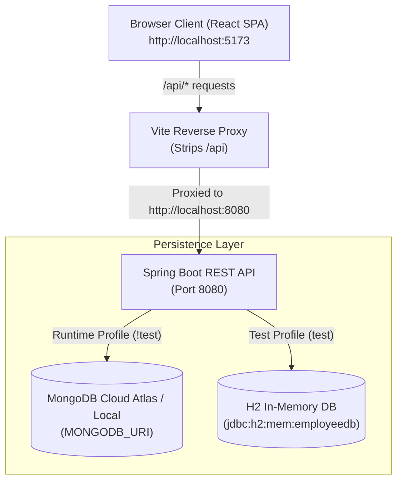

# Employee Management System

A full-stack, enterprise-grade Employee Management Application consisting of a **Spring Boot REST API** backend and a modern **React + Vite** single-page application (SPA) frontend.

---

## Architecture & Deployment


### Production Deployment Architecture
- **Cluster Platform**: Hosted on a **Rancher / Kubernetes Cluster** managing containerized workloads.
- **Ingress Routing**:
  - `/` routes browser traffic directly to the **React Frontend** pod.
  - `/api/*` proxies API requests to the **Spring Boot API** pod.
- **Inter-Service Communication**: React SPA uses relative `/api` paths, allowing seamless proxying by the Ingress Controller.
- **Cloud Data Persistence**: Spring Boot REST API connects to **MongoDB Atlas** (Fully Managed Cloud DB) with credentials securely supplied via Secret Injection.

### Local Development Flow



---

## Projects in this Repository

| Component | Subdirectory | Description | Tech Stack |
| :--- | :--- | :--- | :--- |
| **Backend API** | [`employee-management-api`](file:///Users/dixon/Projects/Personal/Dixon%20AI/employee-management/employee-management-api) | RESTful web services, business logic, MongoDB runtime & H2 test persistence | Java 25, Spring Boot 3.4.2, Spring Data MongoDB, Spring Data JPA, H2 |
| **Frontend UI** | [`employee-management-ui`](file:///Users/dixon/Projects/Personal/Dixon%20AI/employee-management/employee-management-ui) | Modern glassmorphic SPA dashboard for team directory management | React 18, Vite 5.4, Tailwind CSS, Lucide React, Axios |

---

## Key Features

- **Full-Stack CRUD Operations**: Create, read, update, and delete employee records seamlessly from the frontend UI or directly via REST endpoints.
- **Dual Database Persistence Model**:
  - **Runtime Application**: Operates on **Spring Data MongoDB** using connection settings specified in `.env`.
  - **Automated Test Suite**: Executes 100% offline using **Spring Data JPA** and an in-memory **H2 Database** (`jdbc:h2:mem:employeedb`).
- **Auto UUID Assignment**: Backend service automatically assigns a unique UUID string when creating new employees if an ID is omitted.
- **Vite Reverse Proxy**: Seamless development routing where frontend `/api/employees` calls are automatically rewritten and proxied to backend `http://localhost:8080/employees`.
- **Fault-Tolerant Exception Handling**: Global exception handler returning structured HTTP `503 Service Unavailable` JSON responses during database cluster connection timeouts.

---

## Repository Structure

```text
employee-management/
├── README.md                      # Workspace Root Documentation (This File)
├── docs/                          # Project Architecture & Media Assets
│   └── images/
│       └── deployment-architecture.jpg  # Rancher & MongoDB Atlas Architecture Diagram
├── employee-management-api/       # Spring Boot Backend API Project
│   ├── .env                       # Environment Variables (MONGODB_URI, PORT)
│   ├── pom.xml                    # Maven Dependencies & Build Configuration
│   ├── README.md                  # Comprehensive API Documentation
│   └── src/                       # Application & Test Source Code
└── employee-management-ui/        # React + Vite Frontend Project
    ├── package.json               # NPM Dependencies & Scripts
    ├── vite.config.js             # Vite Proxy & Server Settings
    ├── README.md                  # Comprehensive UI Documentation
    └── src/                       # Components, Services & Assets
```

---

## Quick Start Guide

### Prerequisites

- **Java Development Kit (JDK)**: Java 21 or Java 25+
- **Apache Maven**: 3.8+
- **Node.js**: v18+ or v20+
- **MongoDB**: Active MongoDB Atlas cluster or local instance (`mongodb://localhost:27017`)

---

### Step 1: Start Backend REST API

```bash
cd employee-management-api

# Compile the Spring Boot API
mvn clean compile

# Run the API server (Starts on http://localhost:8080)
mvn spring-boot:run
```

---

### Step 2: Start Frontend UI Dashboard

Open a separate terminal window:

```bash
cd employee-management-ui

# Install dependencies
npm install

# Start Vite dev server (Launches on http://localhost:5173)
npm run dev
```

Open your browser and navigate to **`http://localhost:5173`**.

---

## Running Automated Tests

Run the complete 20-case automated unit and integration test suite across API controllers, services, and repositories:

```bash
cd employee-management-api
mvn clean test
```

---

## API Reference Overview

| Method | Endpoint | Description | Request Body |
| :--- | :--- | :--- | :--- |
| `GET` | `/` | API Status & Health Check | None |
| `GET` | `/employees` | Retrieve all employees | None |
| `POST` | `/employees` | Create a new employee (Auto UUID if `id` omitted) | Employee JSON |
| `GET` | `/employees/{id}` | Retrieve employee by ID | None |
| `PUT` | `/employees/{id}` | Update existing employee details | Employee JSON |
| `DELETE` | `/employees/{id}` | Delete employee by ID | None |

---

## Detailed Component Documentation

- For in-depth API architecture, endpoint schemas, and testing configuration, see **[`employee-management-api/README.md`](file:///Users/dixon/Projects/Personal/Dixon%20AI/employee-management/employee-management-api/README.md)**.
- For frontend component hierarchy, proxy routing details, and styling tokens, see **[`employee-management-ui/README.md`](file:///Users/dixon/Projects/Personal/Dixon%20AI/employee-management/employee-management-ui/README.md)**.

---

## License

This project is licensed under the MIT License.
