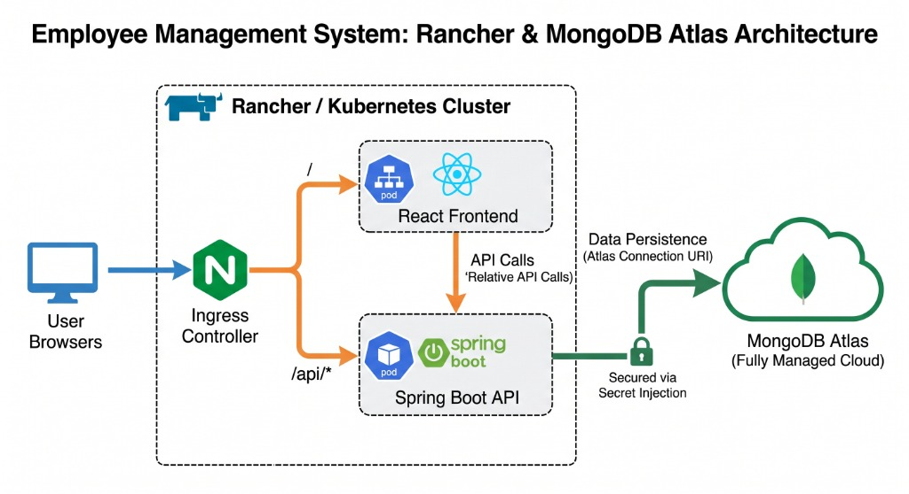
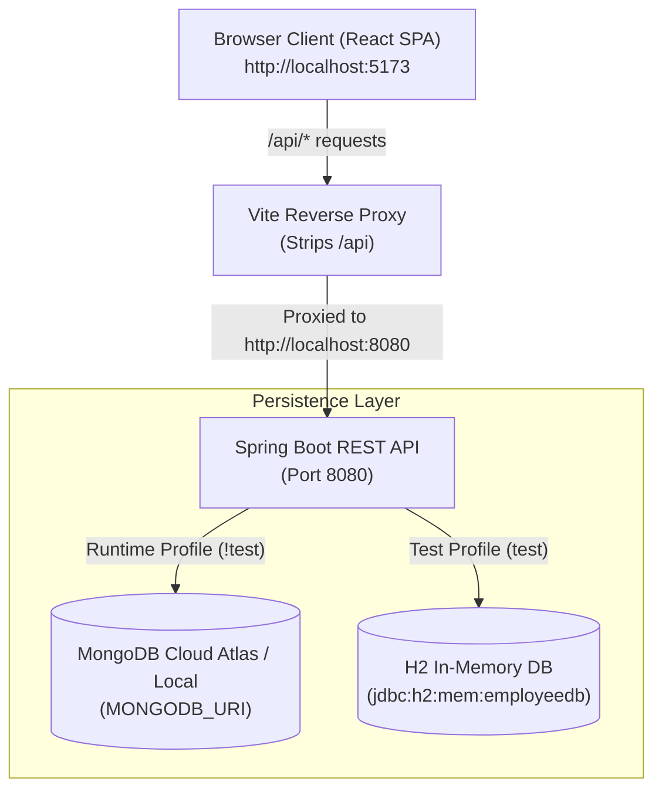

# Employee Management System

A full-stack, enterprise-grade Employee Management Application consisting of a **Spring Boot REST API** backend and a modern **React + Vite** single-page application (SPA) frontend.

---

## Architecture & Deployment



### Production Deployment Architecture
- **Cluster Platform**: Hosted on a **Rancher / Kubernetes Cluster** managing containerized workloads.
- **Ingress Routing**:
  - `/` routes browser traffic directly to the **React Frontend** pod.
  - `/api/*` proxies API requests to the **Spring Boot API** pod.
- **Inter-Service Communication**: React SPA uses relative `/api` paths, allowing seamless proxying by the Ingress Controller.
- **Cloud Data Persistence**: Spring Boot REST API connects to **MongoDB Atlas** (Fully Managed Cloud DB) with credentials securely supplied via Secret Injection.

### Local Development Flow



---

## Projects in this Repository

| Component | Subdirectory | Description | Tech Stack |
| :--- | :--- | :--- | :--- |
| **Backend API** | [`employee-management-api`](file:///Users/dixon/Projects/Personal/Dixon%20AI/employee-management/employee-management-api) | RESTful web services, business logic, MongoDB runtime & H2 test persistence | Java 25, Spring Boot 3.4.2, Spring Data MongoDB, Spring Data JPA, H2 |
| **Frontend UI** | [`employee-management-ui`](file:///Users/dixon/Projects/Personal/Dixon%20AI/employee-management/employee-management-ui) | Modern glassmorphic SPA dashboard for team directory management | React 18, Vite 5.4, Tailwind CSS, Lucide React, Axios |

---

## Key Features

- **Full-Stack CRUD Operations**: Create, read, update, and delete employee records seamlessly from the frontend UI or directly via REST endpoints.
- **Spring Security & JWT Authentication**:
  - Stateless API authentication using Spring Security filter chain and signed JWT tokens (`Authorization: Bearer <token>`).
  - Account-level login toggle (`loginEnabled`) and password requirement validation.
  - UI authentication gate: Full system UI is locked behind a modern glassmorphic Login screen.
- **AES-256-GCM Password Encryption**: Strong symmetric encryption for stored employee passwords using AES-256-GCM with secret key configured via `ENCRYPTION_SECRET_KEY` in `.env`.
- **Dual Database Persistence Model**:
  - **Runtime Application**: Operates on **Spring Data MongoDB** using connection settings specified in `.env`.
  - **Automated Test Suite**: Executes 100% offline using **Spring Data JPA** and an in-memory **H2 Database** (`jdbc:h2:mem:employeedb`).
- **Auto UUID Assignment**: Backend service automatically assigns a unique UUID string when creating new employees if an ID is omitted.
- **Vite Reverse Proxy**: Seamless development routing where frontend `/api/employees` calls are automatically rewritten and proxied to backend `http://localhost:8080/employees`.
- **Fault-Tolerant Exception Handling**: Global exception handler returning structured HTTP `503 Service Unavailable` JSON responses during database cluster connection timeouts.

---

## Repository Structure

```text
employee-management/
├── README.md                      # Workspace Root Documentation (This File)
├── docs/                          # Project Architecture & Media Assets
│   └── images/
│       └── deployment-architecture.jpg  # Rancher & MongoDB Atlas Architecture Diagram
├── terraform/                     # Rancher & Kubernetes Terraform Deployment IaC
│   ├── providers.tf               # Kubernetes Provider Definition
│   ├── variables.tf               # Input Variables (Replicas, Images, MongoDB URI)
│   ├── main.tf                    # Namespace, Deployments, Services, Secret & Ingress
│   ├── outputs.tf                 # Output Endpoints & Service Names
│   └── terraform.tfvars.example   # Example Variables Template
├── employee-management-api/       # Spring Boot Backend API Project
│   ├── Dockerfile                 # Multi-stage Docker Build (JDK 21 + Maven)
│   ├── .env                       # Environment Variables (MONGODB_URI, PORT, ENCRYPTION_SECRET_KEY)
│   ├── pom.xml                    # Maven Dependencies & Build Configuration
│   ├── README.md                  # Comprehensive API Documentation
│   └── src/                       # Security, Controllers, Services & Tests
└── employee-management-ui/        # React + Vite Frontend Project
    ├── Dockerfile                 # Multi-stage Docker Build (Node 20 + Nginx)
    ├── package.json               # NPM Dependencies & Scripts
    ├── vite.config.js             # Vite Proxy & Server Settings
    ├── README.md                  # Comprehensive UI Documentation
    └── src/                       # Login, Layout, List & Form Modal Components
```

---

## Rancher / Kubernetes Deployment (Terraform)

Deploy the application to your **Rancher / Kubernetes Cluster** as illustrated in the architecture diagram:

### Prerequisites

- **Terraform CLI**: `>= 1.3.0`
- **Kubectl / Kubeconfig**: Authenticated access to your Rancher cluster (`~/.kube/config`).
- **Nginx Ingress Controller**: Installed on your Rancher cluster.

---

### Step 1: Build Container Images (Local Rancher or Remote Registry)

#### Option A: Local Rancher (No Docker Hub push required)
If you are running **Rancher Desktop** (with Docker / containerd runtime):
```bash
# Build API image locally
docker build -t employee-management-api:latest ./employee-management-api

# Build UI image locally
docker build -t employee-management-ui:latest ./employee-management-ui
```
Because the Terraform configuration sets `image_pull_policy = "IfNotPresent"`, Kubernetes will use your locally built images directly.

#### Option B: Push to Docker Hub or Registry (For remote Rancher clusters)
```bash
# Tag and push API image
docker build -t <your-username>/employee-management-api:latest ./employee-management-api
docker push <your-username>/employee-management-api:latest

# Tag and push UI image
docker build -t <your-username>/employee-management-ui:latest ./employee-management-ui
docker push <your-username>/employee-management-ui:latest
```

---

### Step 2: Apply Terraform Configuration

```bash
cd terraform

# Create variable file
cp terraform.tfvars.example terraform.tfvars
```

Update `terraform.tfvars` with your settings (e.g. `api_image`, `ui_image`, `mongodb_uri`).

```bash
# Initialize & apply
terraform init
terraform plan
terraform apply
```

This provisions:
- Namespace `employee-management`
- Kubernetes Secret `mongodb-atlas-secret` with your Atlas URI
- Spring Boot REST API Deployment & Service (Port 8080)
- React SPA Frontend Deployment & Service (Port 80)
- Nginx Ingress Controller routing `/` to Frontend and `/api/*` to Backend API

---

---

## Quick Start Guide

### Prerequisites

- **Java Development Kit (JDK)**: Java 21 or Java 25+
- **Apache Maven**: 3.8+
- **Node.js**: v18+ or v20+
- **MongoDB**: Active MongoDB Atlas cluster or local instance (`mongodb://localhost:27017`)

---

### Step 1: Start Backend REST API

```bash
cd employee-management-api

# Compile the Spring Boot API
mvn clean compile

# Run the API server (Starts on http://localhost:8080)
mvn spring-boot:run
```

---

### Step 2: Start Frontend UI Dashboard

Open a separate terminal window:

```bash
cd employee-management-ui

# Install dependencies
npm install

# Start Vite dev server (Launches on http://localhost:5173)
npm run dev
```

Open your browser and navigate to **`http://localhost:5173`**.

---

## Running Automated Tests

Run the complete 27-case automated unit and integration test suite across API controllers, security, services, and repositories:

```bash
cd employee-management-api
mvn clean test
```

---

## API Reference Overview

| Method | Endpoint | Access | Description | Request Body |
| :--- | :--- | :--- | :--- | :--- |
| `GET` | `/` | Public | API Status & Health Check | None |
| `POST` | `/auth/login` | Public | System Authentication & JWT Token Issuance | `{ "emailId", "password" }` |
| `GET` | `/employees` | Authenticated (`Bearer`) | Retrieve all employees | None |
| `POST` | `/employees` | Authenticated (`Bearer`) | Create a new employee (Auto UUID if `id` omitted) | Employee JSON |
| `GET` | `/employees/{id}` | Authenticated (`Bearer`) | Retrieve employee by ID | None |
| `PUT` | `/employees/{id}` | Authenticated (`Bearer`) | Update existing employee details | Employee JSON |
| `DELETE` | `/employees/{id}` | Authenticated (`Bearer`) | Delete employee by ID | None |


---

## Detailed Component Documentation

- For in-depth API architecture, endpoint schemas, and testing configuration, see **[`employee-management-api/README.md`](file:///Users/dixon/Projects/Personal/Dixon%20AI/employee-management/employee-management-api/README.md)**.
- For frontend component hierarchy, proxy routing details, and styling tokens, see **[`employee-management-ui/README.md`](file:///Users/dixon/Projects/Personal/Dixon%20AI/employee-management/employee-management-ui/README.md)**.

---

## License

This project is licensed under the MIT License.
