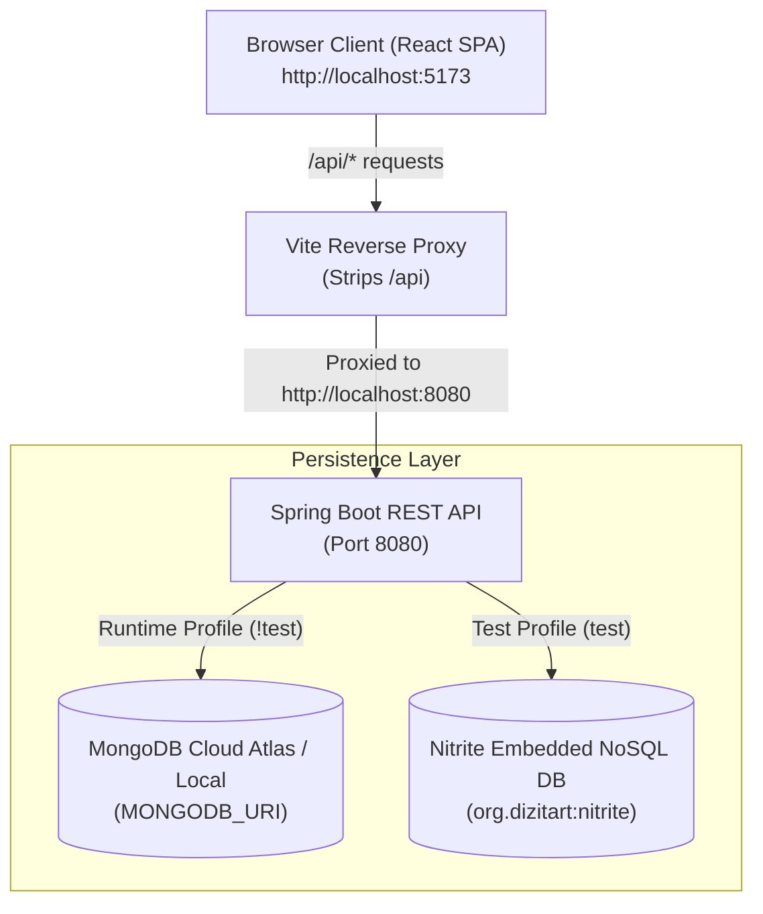

# Employee Management System

A full-stack, enterprise-grade Employee Management Application consisting of a **Spring Boot REST API** backend and a modern **React + Vite** single-page application (SPA) frontend.

---

## Architecture & Deployment


### Production Deployment Architecture

- **Cluster Platform**: Hosted on a **Rancher / Kubernetes Cluster** managing containerized workloads.
- **Ingress Routing**:
  - `/` routes browser traffic directly to the **React Frontend** pod.
  - `/api/*` proxies API requests to the **Spring Boot API** pod.
- **Inter-Service Communication**: React SPA uses relative `/api` paths, allowing seamless proxying by the Ingress Controller.
- **Cloud Data Persistence**: Spring Boot REST API connects to **MongoDB Atlas** (Fully Managed Cloud DB) with credentials securely supplied via Secret Injection.

### Local Development Flow



---

## Projects in this Repository

| Component       | Subdirectory                                                                                                              | Description                                                                      | Tech Stack                                                        |
| :-------------- | :------------------------------------------------------------------------------------------------------------------------ | :------------------------------------------------------------------------------- | :---------------------------------------------------------------- |
| **Backend API** | [`employee-management-api`](file:///Users/dixon/Projects/Personal/Dixon%20AI/employee-management/employee-management-api) | RESTful web services, business logic, MongoDB runtime & Nitrite test persistence | Java 25, Spring Boot 3.4.2, Spring Data MongoDB, Nitrite NoSQL DB |
| **Frontend UI** | [`employee-management-ui`](file:///Users/dixon/Projects/Personal/Dixon%20AI/employee-management/employee-management-ui)   | Modern glassmorphic SPA dashboard for team directory management                  | React 18, Vite 5.4, Tailwind CSS, Lucide React, Axios             |

---

## Key Features

- **Full-Stack CRUD Operations**: Create, read, update, and delete employee records seamlessly from the frontend UI or directly via REST endpoints.
- **Spring Security & JWT Authentication**:
  - Stateless API authentication using Spring Security filter chain and signed JWT tokens (`Authorization: Bearer <token>`).
  - Account-level login toggle (`loginEnabled`) and password requirement validation.
  - UI authentication gate: Full system UI is locked behind a modern glassmorphic Login screen.
- **BCrypt Password Hashing**: Adaptive, salted one-way password hashing using Spring Security's `BCryptPasswordEncoder`.
- **Dual Database Persistence Model**:
  - **Runtime Application**: Operates on **Spring Data MongoDB** using connection settings specified in `.env`.
  - **Automated Test Suite**: Executes 100% offline using **Nitrite Embedded NoSQL Database** (`org.dizitart:nitrite`).
- **Auto UUID Assignment**: Backend service automatically assigns a unique UUID string when creating new employees if an ID is omitted.
- **Vite Reverse Proxy**: Seamless development routing where frontend `/api/employees` calls are automatically rewritten and proxied to backend `http://localhost:8080/employees`.
- **Fault-Tolerant Exception Handling**: Global exception handler returning structured HTTP `503 Service Unavailable` JSON responses during database cluster connection timeouts.

---

## Repository Structure

```text
employee-management/
├── README.md                      # Workspace Root Documentation (This File)
├── .github/                       # GitHub Workflows & Automation
│   └── workflows/
│       └── publish-ghcr.yaml      # Automated Docker Build, GHCR Publish & K8s Deploy Pipeline
├── docs/                          # Project Architecture & Media Assets
│   └── images/
│       └── deployment-architecture.jpg  # Rancher & MongoDB Atlas Architecture Diagram
├── k8s/                           # Kubernetes Deployment Manifests
│   ├── dev/                       # Development Environment Manifests
│   │   ├── namespace.yaml         # Namespace Manifest (app-em-dev)
│   │   ├── secrets-example.yaml   # Template for MongoDB & GHCR Secrets
│   │   ├── em-api-deployment.yaml # Dev API Deployment & Service Manifest
│   │   ├── em-ui-deployment.yaml  # Dev UI Deployment & Service Manifest
│   │   ├── em-ingress.yaml        # Dev Ingress Subdomain Routing Manifest
│   │   ├── letsencrypt-clusterissuer.yaml # ClusterIssuer Manifest
│   │   └── redirect-middleware.yaml # Traefik HTTPS Redirect Middleware
│   └── prod/                      # Production Environment Manifests
│       ├── namespace.yaml         # Namespace Manifest (app-em-prod)
│       ├── secrets-example.yaml   # Template for MongoDB & GHCR Secrets
│       ├── em-api-deployment.yaml # Production API Deployment & Service Manifest
│       ├── em-ui-deployment.yaml  # Production UI Deployment & Service Manifest
│       ├── em-ingress.yaml        # Production Ingress Subdomain Routing Manifest
│       ├── letsencrypt-clusterissuer.yaml # ClusterIssuer Manifest
│       └── redirect-middleware.yaml # Traefik HTTPS Redirect Middleware
├── employee-management-api/       # Spring Boot Backend API Project
│   ├── Dockerfile                 # Multi-stage Docker Build (JDK 21 + Maven)
│   ├── .env                       # Local Environment Variables (MONGODB_URI, PORT)
│   ├── .env-example               # Example Environment Variables Template
│   ├── pom.xml                    # Maven Dependencies & Build Configuration
│   ├── README.md                  # Comprehensive API Documentation
│   └── src/                       # Security, Controllers, Services & Tests
└── employee-management-ui/        # React + Vite Frontend Project
    ├── Dockerfile                 # Multi-stage Docker Build (Node 20 + Nginx)
    ├── .env                       # Local Environment Variables (VITE_API_URL)
    ├── .env-example               # Example Environment Variables Template
    ├── package.json               # NPM Dependencies & Scripts
    ├── vite.config.js             # Vite Proxy & Server Settings
    ├── README.md                  # Comprehensive UI Documentation
    └── src/                       # Login, Layout, List & Form Modal Components
```

---

## Kubernetes Deployment & GitHub Actions CI/CD

The application is containerized and deployed to a **Kubernetes Cluster** using native Kubernetes deployment manifests and automated GitHub Actions CI/CD workflows.

### 1. Automated CI/CD Pipeline ([`.github/workflows/publish-ghcr.yaml`](file:///Users/dixon/Projects/Personal/Dixon%20AI/employee-management/.github/workflows/publish-ghcr.yaml))

On push to `main` branch, GitHub Actions executes:

1. **API Build**: Compiles Spring Boot JAR with Maven (`mvn clean package -DskipTests`).
2. **Container Build & Push**: Builds and pushes Docker images to GitHub Container Registry (GHCR):
   - `ghcr.io/hiddenstar1000/employee-management-api:latest`
   - `ghcr.io/hiddenstar1000/employee-management-ui:latest`
3. **Automated Kubernetes Secret Sync**: Dynamically creates/updates secrets in namespace `app-em-prod` or `app-em-dev`.
4. **Automated Kubernetes Deployment**: Applies `k8s/prod/` or `k8s/dev/` manifests to the cluster via `kubectl`.

---

### 2. Manual Kubernetes Deployment (`kubectl`)

To deploy manually on your Kubernetes cluster:

#### Deploy Production (`k8s/prod/`)

```bash
# 1. Setup secrets template
cp k8s/prod/secrets-example.yaml k8s/prod/secrets.yaml
# (Edit k8s/prod/secrets.yaml with actual credentials)

# 2. Apply all production secrets
kubectl apply -f k8s/prod/secrets.yaml

# 3. Apply all production configmaps
kubectl apply -f k8s/prod/configmap.yaml

# 4. Apply all production manifests
kubectl apply -f k8s/prod/

# 5. Verify Pods
kubectl get pods -n app-em-prod -w
```

#### Deploy Development (`k8s/dev/`)

```bash
# 1. Setup secrets template
cp k8s/dev/secrets-example.yaml k8s/dev/secrets.yaml
# (Edit k8s/dev/secrets.yaml with actual credentials)

# 2. Apply all development secrets
kubectl apply -f k8s/dev/secrets.yaml

# 3. Apply all development configmaps
kubectl apply -f k8s/dev/configmap.yaml

# 4. Apply all development manifests
kubectl apply -f k8s/dev/

# 5. Verify Pods
kubectl get pods -n app-em-dev -w
```

---

## Quick Start Guide

### Prerequisites

- **Java Development Kit (JDK)**: Java 21 or Java 25+
- **Apache Maven**: 3.8+
- **Node.js**: v18+ or v20+
- **MongoDB**: Active MongoDB Atlas cluster or local instance (`mongodb://localhost:27017`)

---

### Step 1: Start Backend REST API

```bash
cd employee-management-api

# Create local environment configuration from template
cp .env-example .env

# Compile the Spring Boot API
mvn clean compile

# Run the API server (Starts on http://localhost:8080)
mvn spring-boot:run
```

---

### Step 2: Start Frontend UI Dashboard

Open a separate terminal window:

```bash
cd employee-management-ui

# Create local environment configuration from template
cp .env-example .env

# Install dependencies
npm install

# Start Vite dev server (Launches on http://localhost:5173)
npm run dev
```

Open your browser and navigate to **`http://localhost:5173`**.

---

## Running Automated Tests

- **Automated Testing Suite**: 36 comprehensive test cases covering security filters, JWT token providers, controllers, services, global exception handling, and Nitrite embedded NoSQL repositories (`mvn clean test`).

```bash
cd employee-management-api
mvn clean test
```

---

## API Reference Overview

| Method   | Endpoint          | Access                   | Description                                       | Request Body                |
| :------- | :---------------- | :----------------------- | :------------------------------------------------ | :-------------------------- |
| `GET`    | `/`               | Public                   | API Status & Health Check                         | None                        |
| `POST`   | `/auth/login`     | Public                   | System Authentication & JWT Token Issuance        | `{ "emailId", "password" }` |
| `GET`    | `/employees`      | Authenticated (`Bearer`) | Retrieve all employees                            | None                        |
| `POST`   | `/employees`      | Authenticated (`Bearer`) | Create a new employee (Auto UUID if `id` omitted) | Employee JSON               |
| `GET`    | `/employees/{id}` | Authenticated (`Bearer`) | Retrieve employee by ID                           | None                        |
| `PUT`    | `/employees/{id}` | Authenticated (`Bearer`) | Update existing employee details                  | Employee JSON               |
| `DELETE` | `/employees/{id}` | Authenticated (`Bearer`) | Delete employee by ID                             | None                        |

---

## Detailed Component Documentation

- For in-depth API architecture, endpoint schemas, and testing configuration, see **[`employee-management-api/README.md`](file:///Users/dixon/Projects/Personal/Dixon%20AI/employee-management/employee-management-api/README.md)**.
- For frontend component hierarchy, proxy routing details, and styling tokens, see **[`employee-management-ui/README.md`](file:///Users/dixon/Projects/Personal/Dixon%20AI/employee-management/employee-management-ui/README.md)**.

---

## License

This project is licensed under the MIT License.
